= FTP Configuration and Security

FTP (File Transfer Protocol) is a standard network protocol used to transfer files between a client and a server on a computer network. It is widely used for sharing files, backing up data, and managing website files. In this guide, you will learn how to configure an FTP server for both anonymous and local user authentication, as well as implement security measures such as encryption and access controls.

For more information on the activity requirements, you can view the detailed document link: ftp-anonymous-and-local-users.pdf[here].

== FTP

=== 1. Install FTP server software on the assigned machine

The first step is to install the `vsftpd` package, which is a secure and fast FTP server. We will use Ansible's `apt` module to ensure the package is installed and up-to-date.

[source,yaml]
----
- name: Install vsftpd package
  ansible.builtin.apt:
    name: vsftpd
    state: present
    update_cache: yes
----
* This ensures that the server software is installed and ready for configuration.

=== 2. Configure the FTP server to allow anonymous connections

To allow unauthenticated users to access the FTP server, we need to enable anonymous access in the `vsftpd.conf` configuration file. This is often required for public file sharing but should be carefully secured.

[source,ini]
----
anonymous_enable=YES
----
* Enabling anonymous access allows users to connect without providing credentials, which is useful for providing public file access.

=== 3. Set secure access permissions for shared directories

We need to create a root directory for anonymous FTP access, ensuring that it is restricted to read-only access. This step ensures the security of the shared data.

[source,yaml]
----
- name: Create anonymous FTP root directory
  ansible.builtin.file:
    path: /srv/ftp
    state: directory
    owner: ftp
    group: ftp
    mode: '0555'
----
* The directory `/srv/ftp` is created with read-only permissions (`0555`), ensuring that anonymous users can only download files but cannot modify or delete anything.

=== 4. Local users are not allowed

If you want to prevent local users from logging into the FTP server, you can disable local user login. This is useful for securing the server if you only want to allow anonymous access.

[source,ini]
----
local_enable=NO
----
* Disabling local user login (`local_enable=NO`) prevents any locally authenticated users from accessing the FTP server.

=== 5. Anonymous users have NO write permissions

To enhance security, we ensure that anonymous users do not have the ability to upload files, create directories, or modify existing files.

[source,ini]
----
write_enable=NO 
anon_upload_enable=NO 
anon_mkdir_write_enable=NO
----
* These settings prevent anonymous users from modifying or adding files, ensuring that the FTP server is only used for file retrieval, not file modification.

=== 6. Anonymous users are not asked for an anonymous password

To simplify the connection process for anonymous users, we configure the server so that users do not need to enter a password when connecting anonymously.

[source,ini]
----
no_anon_password=YES
----
* Setting `no_anon_password=YES` ensures that anonymous users are not prompted for a password, making the server more accessible.

=== 7. Data connection timeout will be 30 seconds

To prevent hanging or abandoned connections from taking up server resources, we set a timeout for the data connection.

[source,ini]
----
data_connection_timeout=30
----
* The `data_connection_timeout` ensures that inactive connections are terminated after 30 seconds, freeing up resources and preventing potential security risks.

=== 8. Limit max data transfer bandwidth to 5KB/s

To prevent excessive bandwidth usage by anonymous users, we set a maximum data transfer rate limit.

[source,ini]
----
anon_max_rate=5120
----
* This setting restricts anonymous users to a data transfer rate of 5KB per second (`5120` bytes), which helps avoid server overload and controls network bandwidth.

=== 9. The server shows a banner "Welcome to SRI FTP anonymous server"

Adding a custom banner is a good way to provide information to users when they connect to the FTP server. This can be a greeting message or important instructions.

[source,ini]
----
ftpd_banner=Welcome to SRI FTP anonymous server
----
* The `ftpd_banner` setting allows you to display a welcoming message, informing users about the server or any specific usage policies.

=== 10. The server shows an ASCII art file in the login directory

To further personalize the experience, the server can display an ASCII art banner. We will use Ansible to copy an ASCII art file to the correct directory on the server.

[source,yaml]
----
- name: Copy banner file
  ansible.builtin.copy:
    src: ../files/ftp/provisional2_message.txt
    dest: /etc/vsftpd.banner
----
* This task copies the ASCII art file to the server, which will be displayed during login.

Then, specify the banner file location in the `vsftpd.conf` configuration:

[source,ini]
----
banner_file=/etc/vsftpd.banner
----
* This setting ensures that the ASCII art file is shown when users log into the FTP server.

=== 11. Test the configuration with two clients

We can try with the terminal, we can see that the connection was successful.

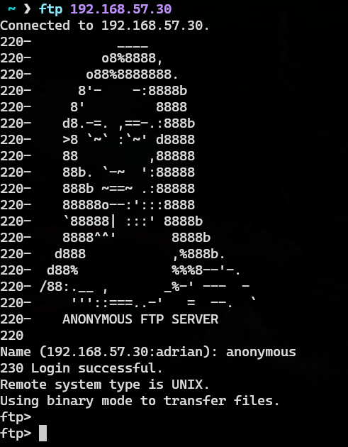

Now, we try with FileZilla, just enter with anonymous:

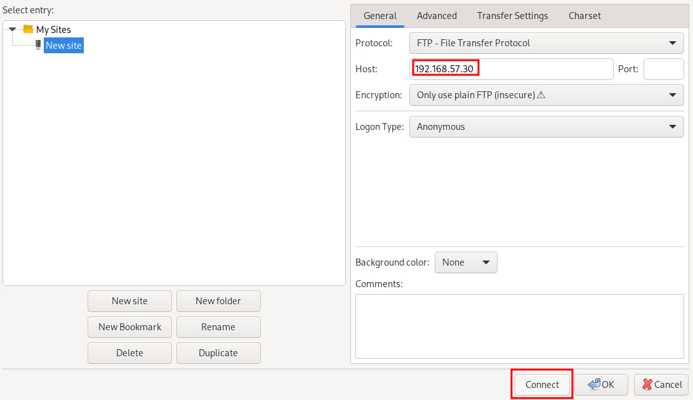

As you can see we can connect perfectly.

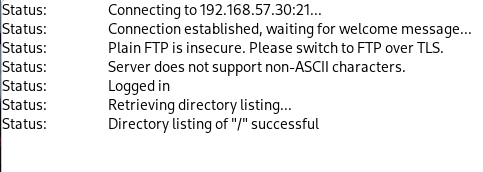

==== Passive Mode

Passive mode is the default mode in FileZilla, so just by connecting to the server we are using passive mode.

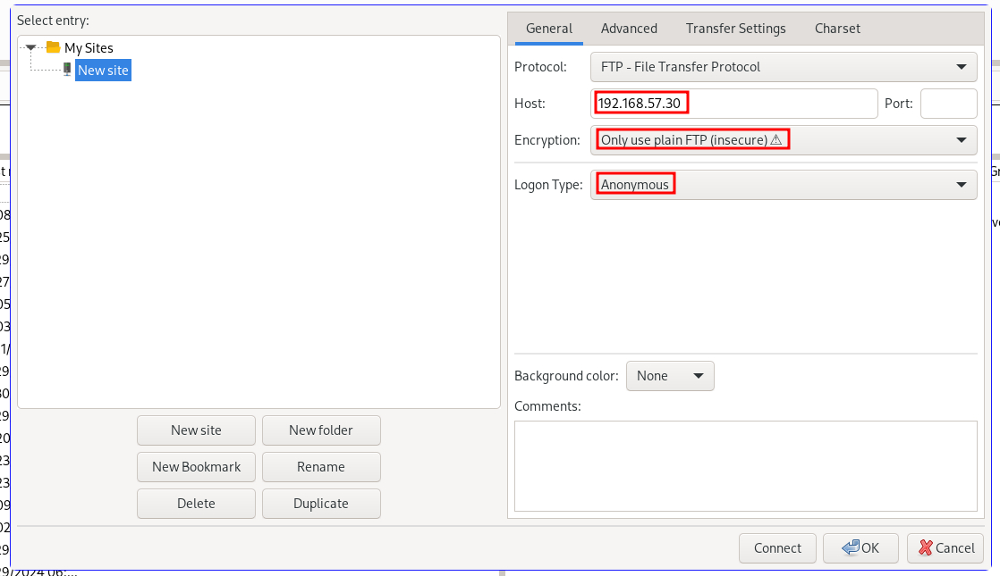

We are correctly using passive mode.

==== Active Mode

If we want to connect with active mode go yo "Tranfer Settings" and select "Active".

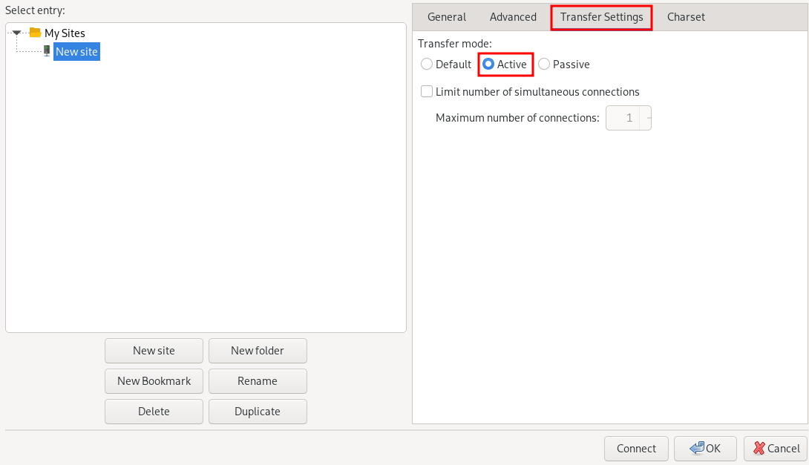

As you can see we are conneting correctly with active mode.

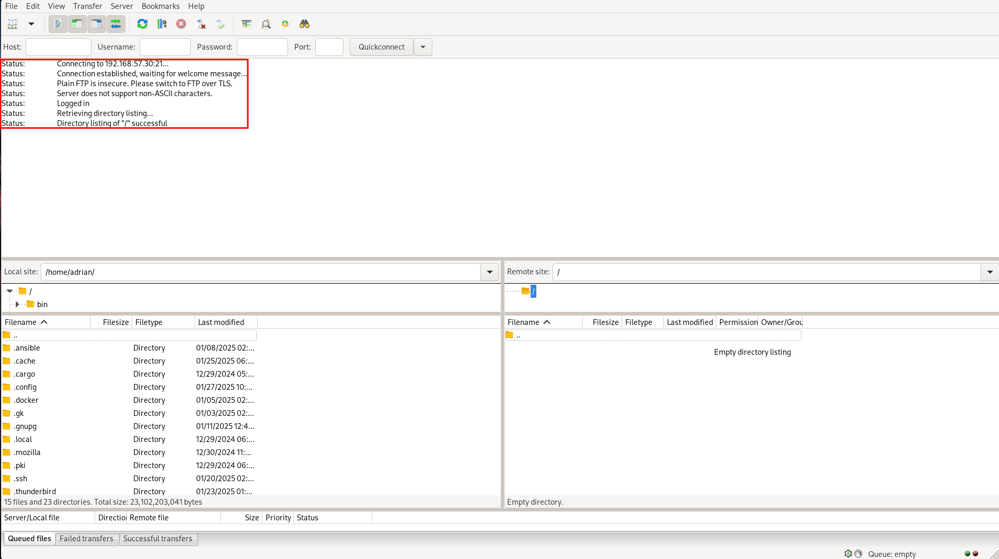

== FTP MIRROR

=== 1.Configuration of the FTP Server with Local Users

We have created the configuration of the mirror machine using an Ansible archive. Below is a step-by-step explanation of all the Ansible features associated with the mirror FTP machine.

=== 2.Inventory Configuration

We created a group for the two FTP servers called `FTPS`. This allows us to install the same software on both machines simultaneously. The inventory file looks like this:

[source,yaml]

----
ftps:
  hosts:
    mirror:
      ansible_ssh_port: 2200
    ftp:
      ansible_ssh_port: 2300

----

=== 3.FTP Service Configuration

Below is the configuration defined in the `ftp-playbook.yml` file. This playbook ensures the FTP service is installed on both machines.

[source,yaml]
----
---
- name: Configure FTP service
  hosts: ftps
  become: True
  tasks:
    - name: Install vsftpd package
      ansible.builtin.apt:
        name: vsftpd
        state: present
        update_cache: yes
----

=== 4.Mirror-Specific Configuration

This section details the configuration of the mirror FTP server.

=== 5.Variables for Passwords and Configuration Paths

The following variables define the passwords for the users and the path for the configuration file. The configuration file will be copied to the correct destination folder.

[source,yaml]
----
- name: Configure FTP service in mirror server
  hosts: mirror
  become: True
  vars:
    charles_password: "{{ '1234' | password_hash('sha512') }}"
    laura_password: "{{ '1234' | password_hash('sha512') }}"
  tasks:
    - name: Copy ftp.vsftpd configuration file
      ansible.builtin.copy:
        src: ../files/ftp/mirror.vsftpd.conf
        dest: /etc/vsftpd.conf
----

=== 6.Chroot List Configuration

The following configuration defines the chroot file path:

[source,yaml]
----
- name: Copy chroot_list for mirror
  ansible.builtin.copy:
    src: ../files/ftp/vsftpd.chroot_list
    dest: /etc/vsftpd.chroot_list
----

==== 7.User Configuration

The users `charles` and `laura` are created with their respective configurations.

`charles`:

[source,yaml]
----
- name: Create users for mirror
  block:
    - name: Create user charles
      ansible.builtin.user:
        name: charles
        password: "{{ charles_password }}"
        shell: /bin/bash
        state: present
----

`laura`:

[source,yaml]
----
- name: Create user laura
  ansible.builtin.user:
    name: laura
    password: "{{ laura_password }}"
    shell: /bin/bash
    state: present
----

=== 8.Directory Configuration for Users

The directories for `charles` and `laura` are created with appropriate ownership and permissions:

[source,yaml]
----
- name: Create home directory for charles
  ansible.builtin.file:
    path: /home/charles/ftp
    state: directory
    owner: charles
    group: charles
    mode: '0755'

- name: Create home directory for laura
  ansible.builtin.file:
    path: /home/laura/ftp
    state: directory
    owner: laura
    group: laura
    mode: '0755'
----

=== 9.Service Restart Configuration

At the end of the playbook, the FTP service is restarted to apply all changes:

[source,yaml]
----
- name: Restart vsftpd service
  hosts: ftps
  become: True
  tasks:
    - name: Restart vsftpd service
      ansible.builtin.service:
        name: vsftpd
        state: restarted
----

==== Chroot List File

The `chroot_list` file specifies the user that is not restricted to their home directory. In this case, only `laura` is listed:

[source,plain]
----
laura
----

=== 10.FTP Server Configuration File

Below is the complete configuration for the FTP server, including settings for authentication, chroot, SSL, and user restrictions:

[source,ini]
----
listen=YES
listen_ipv6=NO
anonymous_enable=NO
local_enable=YES
write_enable=YES
anon_upload_enable=NO
anon_mkdir_write_enable=NO
dirmessage_enable=YES
use_localtime=YES
xferlog_enable=YES
connect_from_port_20=YES
data_connection_timeout=30
ftpd_banner=Welcome to SRI FTP server
chroot_local_user=YES
chroot_list_enable=YES
chroot_list_file=/etc/vsftpd.chroot_list
allow_writeable_chroot=YES
secure_chroot_dir=/var/run/vsftpd/empty
rsa_cert_file=/etc/ssl/certs/ssl-cert-pub.pem
rsa_private_key_file=/etc/ssl/private/ssl-cert-priv.key
ssl_enable=YES
----

Now I'm going to explain the problems I had trying to work at home.

### Report on the Configuration and Troubleshooting Process for Nested Virtualization  

**1. Initial Context**  
- **Main Device**: iMac 2019 with dual boot (macOS and Windows 10).  
- **Objective**: Set up a development environment with VirtualBox, Vagrant, and Ansible on a virtualized Ubuntu machine.  

**2. Initial Setup**  
- **On Windows 10 (iMac)**:  
  - Installed VirtualBox.  
  - Created a virtual machine with Ubuntu.  
- **On the Ubuntu VM**:  
  - Installed Visual Studio Code (VS Code).  
  - Installed Vagrant and Ansible.  
  - Attempted to configure VirtualBox within the VM (nested virtualization).  

**3. Issues Encountered**  
- **Problem**: Nested virtualization did not work despite being enabled in VirtualBox settings.  
- **Investigation and Tests**:  
  - Verified VirtualBox settings.  
  - Checked that nested virtualization was enabled.  
  - Confirmed the processor supported virtualization (Intel VT-x).  
- **Outcome**: Unable to get nested virtualization working.  

**4. Implemented Solution**  
- Decided to use a different device to bypass the limitations of the environment.  

**5. Configuration on the New Device**  
- **Alternative Device**: Windows Surface with Windows 10.  
- **Steps Taken**:  
  - Created an empty partition on Windows to install Ubuntu.  
  - Used Rufus to create a bootable USB with Ubuntu 24.  
  - Installed Ubuntu manually on the empty partition.  
  - Configured dual boot with GRUB (no issues).  

**6. Environment Setup on Ubuntu**  
- **Installed**:  
  - VS Code.  
  - Vagrant.  
  - Ansible.  
- **Issues Found**:  
  - Problems with VirtualBox on Ubuntu.  

**7. Final Observations**  
- The initial configuration on the iMac with dual boot was unfeasible due to nested virtualization limitations in VirtualBox.  
- Installing Ubuntu on the Surface resolved the base environment issues, enabling further setup.  
- Some issues with VirtualBox on the new environment still need to be resolved.  

**8. Recommendations**  
- Verify full support for nested virtualization on both hardware and software before attempting.  
- Consider alternative environments like WSL2 to reduce complexity on Windows systems.  
- Document VirtualBox errors on Ubuntu for specific solutions in future iterations.  

**9. Key Commands Used During the Process**  
- **Create Bootable USB**:  
  - Done via Rufus on Windows.  
- **Install Packages on Ubuntu**:  
----
  sudo apt update && sudo apt install virtualbox vagrant ansible
----

---

### Report on VirtualBox Installation Attempts on Ubuntu  

**1. Initial Context**  
- **OS**: Ubuntu.  
- **Purpose**: Install VirtualBox for managing virtual machines.  
- **Prior Changes**: Secure Boot disabled due to compatibility issues.  

**2. First Attempt**  
- **Command Used**:  
----
  sudo apt install virtualbox
----

- **Result**: Error indicating the version in the default repositories was outdated or incompatible with the current kernel.  
- **Additional Action**: Added the official Oracle repository for VirtualBox:  
----
  sudo add-apt-repository "deb [arch=amd64] https://download.virtualbox.org/virtualbox/debian $(lsb_release -cs) contrib"
  sudo apt update
----

**3. Second Attempt**
- **Command Used After Adding the Repository**:
----
  sudo apt install virtualbox-6.1
----
- **Result**: Dependency errors (e.g., missing `dkms` for kernel module compilation).
- **Additional Actions**: Installed required dependencies:
----
  sudo apt install dkms build-essential linux-headers-$(uname -r)
  sudo apt install virtualbox-6.1
----

**4. Issues with Secure Boot**
- **Problem**: Errors during installation related to kernel module signing due to Secure Boot.  
- **Solution**: Disabled Secure Boot in BIOS/UEFI. Reattempted installation, successfully compiled, and loaded kernel modules.  

**5. Final Observations**
- Main issues:
  - Outdated repositories.
  - Missing dependencies for kernel module compilation.
  - Secure Boot blocking kernel module loading.
- Key steps: Adding the official repository and disabling Secure Boot.

**6. Recommendations**
- Verify kernel version and ensure headers are installed.
- Always use Oracle’s official repository for the latest VirtualBox version.
- Disable Secure Boot when compiling or signing kernel modules is required.

**Commands for Future Reference**
- **Add Official VirtualBox Repository**:
----
  sudo add-apt-repository "deb [arch=amd64] https://download.virtualbox.org/virtualbox/debian $(lsb_release -cs) contrib"
  sudo apt update
----
- **Install VirtualBox and Dependencies**:
----
  sudo apt install dkms build-essential linux-headers-$(uname -r) virtualbox-6.1
----

---

### Report on python3-passlib Installation Attempts on Ubuntu

**1. Initial Context**
- **OS**: Ubuntu.
- **Purpose**: Install `python3-passlib` library for a project.
- **Prior Changes**: Secure Boot disabled to enable VirtualBox.

**2. First Attempt**
- **Command Used**:
----
  sudo apt install python3-passlib
----
- **Result**: Error indicating the package could not be located, likely due to:  
  - Outdated repositories.  
  - Missing configuration for required repositories.  
- **Additional Action**: Verified internet connection and updated repositories:  
----
  sudo apt update
----

**3. Second Attempt**
- **Command with pip**:
----
  pip3 install passlib
----
- **Result**: Permission errors for global installation.
- **Proposed Solution**: Run the command with superuser privileges:
----
----

**4. Virtual Environment Creation**
- **Commands Used**:
----
  python3 -m venv env
  source env/bin/activate
  pip install passlib
----
- **Result**: Created virtual environment, but `pip install passlib` failed due to an outdated `pip`.
- **Additional Action**: Updated `pip` in the virtual environment:
----
  pip install --upgrade pip
----
  Successfully installed `passlib` afterward.

**5. Final Observations**  
- Secure Boot does not directly affect Python package installations.  
- Main issues:
  - Outdated Ubuntu repositories.  
  - Permissions for global installation with `pip`.  
  - Outdated `pip` in the virtual environment.  
- Using a virtual environment was the most effective solution.  

**6. Recommendations**  
- Use virtual environments to avoid permission and dependency issues.  
- Ensure repositories are updated before installing packages with `apt`.  
- Regularly update `pip` to avoid compatibility issues.  

**Command for Future Reference**  
- **Install python3-passlib with apt**:  
----
  sudo apt update && sudo apt install python3-passlib
----
- **Using a Virtual Environment**:  
----
  python3 -m venv env
  source env/bin/activate
  pip install passlib
----

== 4.3. Implementation of Encryption (SSL/TLS)

SSL/TLS (Secure Sockets Layer / Transport Layer Security) are cryptographic protocols designed to provide secure communication over a computer network. Implementing SSL/TLS on an FTP server ensures that data transferred between the client and the server is encrypted, providing confidentiality and integrity of the files being transferred. It also prevents eavesdropping, tampering, and forgery of data.

Here we will document the process of configuring SSL/TLS encryption on a second FTP server to secure file transfers.

=== 1. Configure the SSL/TLS security layer on the second FTP server

To enable SSL/TLS encryption on the second FTP server, we need to modify the `vsftpd.conf` configuration file and configure the server to support secure connections.

First, ensure that the `vsftpd` package has SSL/TLS support enabled. The SSL/TLS configuration can be added to `vsftpd.conf` by specifying the necessary settings for SSL and the paths to the SSL certificate and key files.

[source,ini]
----
ssl_enable=YES
rsa_cert_file=/etc/ssl/certs/ssl-cert-pub.pem
rsa_private_key_file=/etc/ssl/private/ssl-cert-priv.key
----
* `ssl_enable=YES`: Enables SSL/TLS support.
* `rsa_cert_file`: Path to the server's SSL certificate.
* `rsa_private_key_file`: Path to the server's private key.

These settings ensure that the server will accept secure SSL/TLS connections.

=== 2. Demonstrate the encryption capability during data transfer

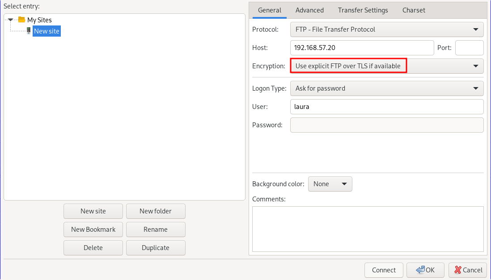
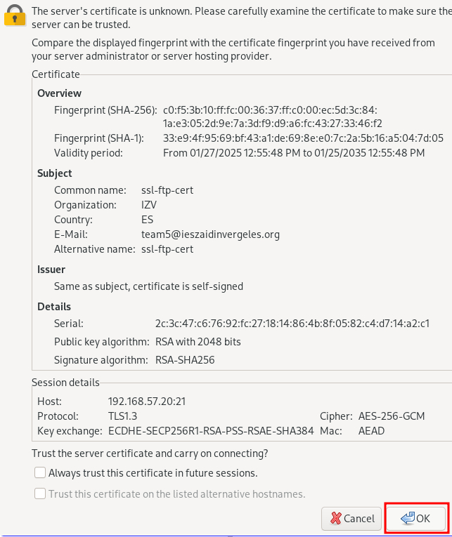
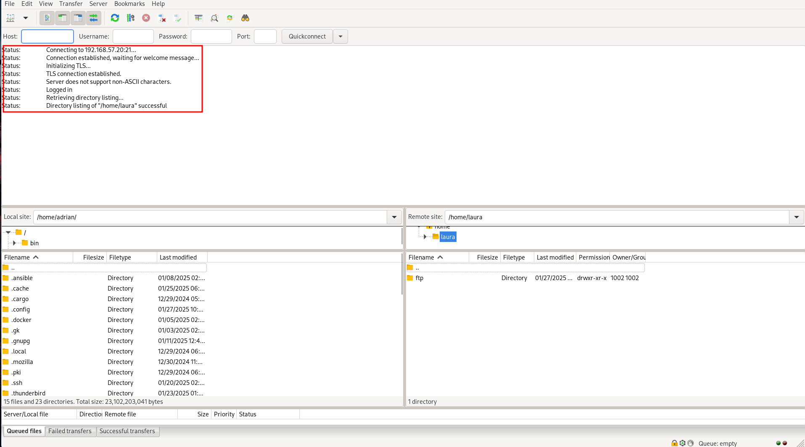

=== 3. Verify correct configuration using testing tools and certificate checks

As you can see we can connect as laura to the ftp server using FileZilla.

It will show us the certificate.

And we can connect to the server correctly using ssl.

=== 4. Local users are forced to connect with a secure connection

As you can see Laura can't connect to the server without ssl, it is a default configuration and we have not changed anything.

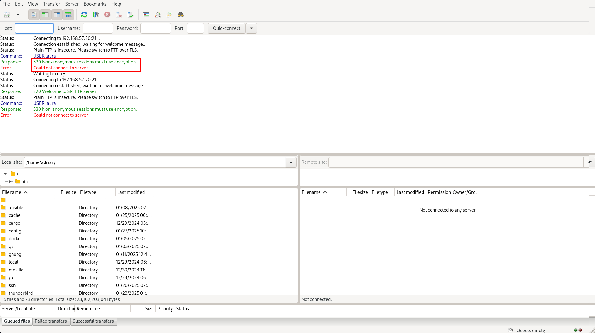

=== 5. Document on the importance of encryption in secure file transfer

Encryption is a critical component of securing file transfers over a network. Without encryption, sensitive data can be intercepted, tampered with, or stolen during transmission. FTP, by default, transmits data in plaintext, which means that any data sent over the network, including usernames, passwords, and file contents, can be easily read by attackers using network sniffing tools.

By implementing SSL/TLS, we ensure that:
* **Data confidentiality**: Files and credentials are encrypted, protecting them from unauthorized access.
* **Data integrity**: SSL/TLS provides mechanisms to detect any tampering with data during transmission.
* **Authentication**: Ensures that both the client and server can authenticate each other, preventing man-in-the-middle attacks.

Overall, SSL/TLS encryption provides a secure environment for file transfer, reducing the risk of data breaches and ensuring compliance with security policies and regulations, such as GDPR or HIPAA.

By enforcing SSL/TLS for all connections, we can ensure that both anonymous and local users transmit data securely, which is vital for maintaining the confidentiality and integrity of transferred files.

== DNS

== 4.4. Configuration of DNS server

The **DNS (Domain Name System)** is a system responsible for translating human-readable domain names, such as `ns.sri.ies`, into machine-readable IP addresses, and vice versa. This system is fundamental for network communication, as it allows users and applications to connect to services without needing to remember numerical IP addresses.

In this task, we configured a DNS server to handle forward and reverse resolution for the `sri.ies` domain. This includes defining the records for key services within the domain (`ns.sri.ies`, `mirror.sri.ies`, `ftp.sri.ies`) and enabling external queries to be forwarded to a public DNS server. Below, I explain in detail the steps followed to complete this setup.

=== 1. Install a third virtual machine with a FTP server with authority on the domain sri.ies. This machine is ns.sri.ies.

This machine is ns.sri.ies.

The first step was to install and configure a virtual machine designated as `ns.sri.ies`. This machine serves two purposes:
  - It acts as the primary DNS server for the `sri.ies` domain.
  - It provides authority over the `sri.ies` domain, meaning it is responsible for responding to DNS queries about names and IP addresses within this domain.

[source,ruby]
----
config.vm.define "dns" do |dns|
    dns.vm.hostname = "ns.sri.ies"
    dns.vm.network "private_network", ip: "192.168.57.10"
    dns.vm.network "forwarded_port", guest: 22, host: 2100
end
----

To achieve this:

  - I installed the BIND9 DNS server software on the virtual machine.

[source,yaml]
----
- name: Install bind9
  apt:
   name: 
   - bind9
   - bind9utils
   - bind9-doc
   update_cache: yes
----

  - I configured the `named.conf.local` file to define the forward and reverse zones for the domain `sri.ies`. The forward zone resolves domain names to IP addresses, and the reverse zone resolves IP addresses back to domain names.

[source,bash]
----
zone "sri.ies" {
      type master;
      file "/etc/bind/db.sri.ies";
  };
----

  - Finally, I created the zone files (`/etc/bind/db.sri.ies` for forward resolution and `/etc/bind/db.192.168.57` for reverse resolution) to include the necessary DNS records.

=== 2. It has record for mirror.sri.ies that points to the anonymous FTP server and ftp.sri.ies for the local user's FTP server.

Next, I configured DNS records to define the key services within the `sri.ies` domain:
  - **Forward resolution (A records):**
	- `ns.sri.ies` -> `192.168.57.10`
	- `mirror.sri.ies` -> `192.168.57.20` (anonymous FTP server)
	- `ftp.sri.ies` -> `192.168.57.30` (FTP server for local users)
  - **Reverse resolution (PTR records):**
	- `192.168.57.10` -> `ns.sri.ies`
	- `192.168.57.20` -> `mirror.sri.ies`
	- `192.168.57.30` -> `ftp.sri.ies`

The forward records are stored in the forward zone file (`db.sri.ies`), while the reverse records are in the reverse zone file (`db.192.168.57`).

These records allow devices in the network to resolve domain names to their corresponding IP addresses and vice versa, ensuring proper connectivity.

==== db.sri.ies

[source,bash]
----
; Zona sri.ies
$ORIGIN sri.ies.
$TTL 604800
@       IN      SOA     ns.sri.ies. admin.sri.ies. (
		  2           ; Serial
		  604800      ; Refresh
		  86400       ; Retry
		  2419200     ; Expire
		  604800 )    ; Negative Cache TTL
  ;
@       IN      NS      ns.sri.ies.
ns      IN      A       192.168.57.10
mirror  IN      A       192.168.57.20
ftp     IN      A       192.168.57.30
----

==== db.192.168.57

[source,bash]
----
; Zona inversa para 192.168.57.0/24
$TTL    604800
@       IN      SOA     ns.sri.ies. admin.sri.ies. (
		  2           ; Serial
		  604800      ; Refresh
		  86400       ; Retry
		  2419200     ; Expire
		  604800 )    ; Negative Cache TTL
  ;
    @       IN      NS      ns.sri.ies.
10        IN      PTR     ns.sri.ies.
20        IN      PTR     mirror.sri.ies.
30        IN      PTR     ftp.sri.ies.
----

=== 3. Redirect queries for other domains to Cloudfare's server 1.1.1.1

To ensure the DNS server could resolve domain names outside the `sri.ies` domain, I configured DNS forwarding in the `named.conf.options` file. This involved specifying Cloudflare's public DNS server (`1.1.1.1`) as the forwarder for any queries not related to the `sri.ies` domain.

[source,bash]
----
options {
	directory "/var/cache/bind";

    forwarders {
	    1.1.1.1; // Cloudflare DNS
        1.0.0.1; // Cloudflare DNS
    };

    dnssec-validation auto;
    
    listen-on { any; };
    listen-on-v6 { any; };
};
----

This step ensures that devices within the network can access both internal and external services seamlessly. For example:
  - Internal query: Resolving `ftp.sri.ies` is handled by the local DNS server.
  - External query: Resolving `www.google.com` is forwarded to Cloudflare's DNS server.

=== 4. Both FTP server has ns.sri.ies as name server.

Finally, I configured both FTP servers (`mirror.sri.ies` and `ftp.sri.ies`) to use `ns.sri.ies` as their DNS name server. This ensures that both servers can:
  - Resolve domain names within the `sri.ies` domain, such as `ftp.sri.ies` or `mirror.sri.ies`.
  - Forward external queries to the Cloudflare DNS server through `ns.sri.ies`.

==== resolv.conf

[source, bash]
----
nameserver 192.168.57.10
search sri.ies
----

==== mirror.sri.ies
[source, bash]
----
- name: Copy the resolv.conf
ansible.builtin.copy:
src: "../resolv.conf"
dest: /etc/
----

==== Comprobation:

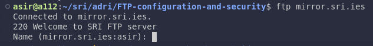

==== ftp.sri.ies

[source, bash]
----
- name: Copy the resolv.conf
ansible.builtin.copy:
  src: "../resolv.conf"
  dest: /etc/
----

==== Comprobation:

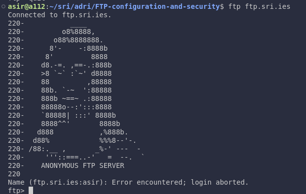

This configuration was validated by testing the resolution of both forward and reverse records using tools like `dig` and a custom Bash script (`dns-test.sh`). The script verified that:
  - Forward queries (e.g., `dig ftp.sri.ies`) return the correct IP addresses.
  - Reverse queries (e.g., `dig -x 192.168.57.30`) return the correct domain names.

==== dns-test.sh

[source,bash]
----
set -euo pipefail

function resolve () {
dig $nameserver +short $@
}

nameserver=@$1

resolve ns.sri.ies
resolve ftp.sri.ies
resolve mirror.sri.ies

resolve -x 192.168.57.10
resolve -x 192.168.57.20
resolve -x 192.168.57.30
----

==== Comprobation:

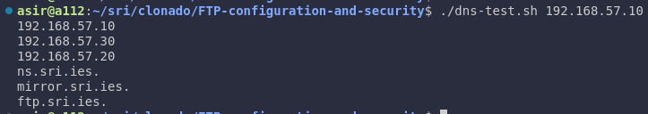

=== Extra information

In order to set the configuration in the dns machine I copy the files into it with the ansible provision

==== ns-playbook.yaml

[source,yaml]
----
- name: Copy the DNS config
  copy:
    src: "{{ item.src }}"
    dest: "{{ item.dest }}"
  loop: 
    - { src: "{{ dns_path }}/named.conf.local", dest: "/etc/bind/" }
    - { src: "{{ dns_path }}/named.conf.options", dest: "/etc/bind/" }
    - { src: "{{ dns_path }}/db.sri.ies", dest: "/etc/bind/" }
    - { src: "{{ dns_path }}/db.192.168.57", dest: "/etc/bind/" }
    - { src: "{{ dns_path }}/named", dest: "/etc/default/" }
    - { src: "../resolv.conf", dest: "/etc/"}
----

We also need to validate and restart bind9 services

==== ns-playbook.yaml
[source,yaml]
----
- name: Validate Bind9 configuration
  command: named-checkconf

- name: Restart bind9
  service:
    name: bind9
    state: restarted
----

And also validate the DNS configuration and the zone file

==== ns-playbook.yaml
[source,yaml]
----
- name: Validate DNS configuration
command: named-checkconf
register: conf_check
failed_when: conf_check.rc != 0

- name: Validate zone file
command: named-checkzone sri.ies /etc/bind/db.sri.ies
register: zone_check
failed_when: zone_check.rc != 0
----

==== /etc/resolv.conf
[source,bash]
----
nameserver 192.168.57.10
----

We have to add this configuration to the main machine were we are running the machines

With this setup, the DNS server successfully manages all domain-related queries for the `sri.ies` network while also providing access to external resources.

== This task has been completed by:

* Adrián Bertos Gómez
* Álvaro García Márquez
* Jesús Martínez Valero
